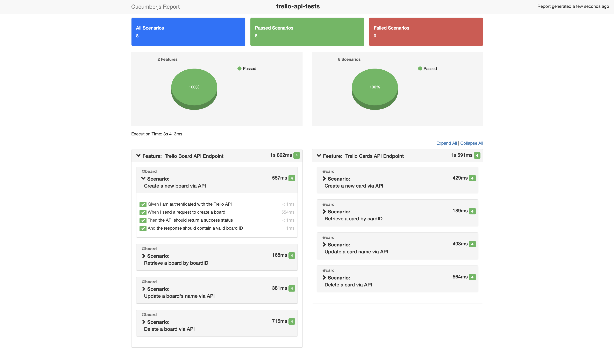

# CreateFuture Focus Area Three

## Introducing API Testing with Playwright & Cucumber

This project is set up for end-to-end testing using [Playwright](https://playwright.dev/) with TypeScript support.
The BDD tool of choice is [Cucumber](https://cucumber.io/).

For this project, I have chosen to demonstrate API testing using [Trello's public API](https://developer.atlassian.com/cloud/trello/rest/) as an example. This allows us to focus on testing API endpoints without the need for a frontend interface. However, the setup could be easily adapted for UI testing as well.

The Trello API is RESTful and uses standard HTTP methods such as GET, POST, PUT, and DELETE.
It will allow the user to create, read, update, and delete resources such as boards and cards, which I have incorporated into the test scenarios available in the `features/` directory.

## Table of Contents

- [Prerequisites](#prerequisites)
- [Getting Started](#getting-started)
  - [1. Clone the repository](#1-clone-the-repository)
  - [2. Install dependencies](#2-install-dependencies)
  - [3. Quick Start](#3-quick-start)
  - [4. Environment Variables](#4-environment-variables)
- [Run tests](#run-tests)
  - [All Tests](#all-tests)
  - [Specific Feature File](#specific-feature-file)
  - [Specific Scenario](#specific-scenario)
  - [Specific Tag](#specific-tag)
  - [Skipping Tests](#skipping-tests)
  - [Conduct a Dry Run](#conduct-a-dry-run)
- [Reporters](#reporters)
- [Cleanup](#cleanup)
- [Configuration](#configuration)
  - [Core config and setup files](#core-config-and-setup-files)
  - [Cucumber Features](#cucumber-features)
  - [Step Definitions](#step-definitions)
  - [Support Files](#support-files)
- [Future Enhancements](#future-enhancements)
- [Extending the Tests](#extending-the-tests)
- [Conclusion](#conclusion)

## Prerequisites

- [Node.js](https://nodejs.org/en/) (version 14 or higher)
- [npm](https://www.npmjs.com/) (comes with Node.js)
- [Visual Studio Code](https://code.visualstudio.com/) (recommended for editing and running the tests)
- [Cucumber for VSCode extension](https://marketplace.visualstudio.com/items?itemName=CucumberOpen.cucumber-official)

## Getting Started

### 1. Clone the repository

Clone this repository to your local machine using the following command:

```bash
git clone https://github.com/Liam-XD/cross-skill-focus-area-three.git

cd cross-skill-focus-area-three
```

### 2. Install dependencies

Run the following commands when within your project root directory:

```bash
npm install
npx playwright install
```

_Note: Playwright requires additional browser binaries to be installed for UI testing. The command `npx playwright install` takes care of this. However, as we are focusing on API testing, this step is optional._

### 3. Quick Start

```bash
git clone https://github.com/Liam-XD/cross-skill-focus-area-three.git && cd cross-skill-focus-area-three && npm install && npx playwright install && code .
```

_Note: for the last part of the command (`code .`) to work, you need to have Visual Studio Code installed and the `code` command available in your system PATH._

_Open VS Code → Press Cmd+Shift+P → run Shell Command: Install 'code' command in PATH._
_Close and reopen your terminal._
_Verify: code --version_

### 4. Environment Variables

Create a `.env` file in the root directory of the project to store your environment variables. Here is an example of what the `.env` file should look like:

```env
TRELLO_API_KEY=your_trello_api_key
TRELLO_API_TOKEN=your_trello_api_token
TRELLO_API_BASE_URL=https://api.trello.com/1/
```

**Important:** Never commit your `.env` file to version control as it contains sensitive information. Ensure it's listed in `.gitignore`.

Make sure to replace `your_trello_api_key` and `your_trello_api_token` with your actual Trello API key and token.

To generate your Trello API key and token, follow these steps:

1. Login or create an Atlassian account [here](https://id.atlassian.com/login?application=trello)
2. Navigate to the admin portal [here](https://trello.com/apps/admin)
3. You may need to join a workspace. If so, create a new board which will also generate a workspace.
4. Return to the admin portal once you have joined a workspace. You should see a 'Your Apps' section.
5. To generate an API key, we first need an app. Click the 'New' button and fill in the required details to create a new app.
6. Once the app is created, you will be able to generate an API key. Click 'Generate a new API Key'. Copy the generated key to your `.env` file.
7. After generating the API key, you can generate a token by clicking on the 'Token' link provided on the same page.
8. Allow the necessary permissions for your token and copy it to your `.env` file.

You are now set up to authenticate your API requests to Trello!

## Run tests

### All Tests

Run the following command to execute all Cucumber feature tests:

```bash
npm run test:cucumber
```

Test results will be displayed in the terminal. A report (e.g., HTML or JSON) will be generated in the reports/ directory.

**Note on running tests:**

- `npm run test:cucumber` runs the Cucumber tests using the script and options defined in the [package.json](package.json) file. This is convenient and ensures consistent options for all users.
- `npx cucumber-js` allows us to run Cucumber directly with custom options or for ad-hoc runs, giving us more flexibility (e.g., specifying feature files, tags, or scenario names on the fly).

### Specific Feature File

If you want to run a specific feature file, use the following command:

```bash
npx cucumber-js path/to/your/feature/file.feature
```

### Specific Scenario

If you want to run a specific scenario within a feature file, use the `--name` option followed by the scenario name in quotes:

```bash
npx cucumber-js path/to/your/feature/file.feature --name "Scenario Name"
```

### Specific Tag

You can also run scenarios based on tags. For example, to run all scenarios tagged with `@smoke`, use the following command:

```bash
npm run test:smoke
```

This will execute all scenarios that have the `@smoke` tag in the feature files.

### Skipping Tests

To skip certain scenarios, you can use the tag `@skip` tag in the feature files. Scenarios tagged with `@skip` will then be ignored during test execution.
This has been configured in the Cucumber configuration file `cucumber.js`.

### Conduct a Dry Run

To verify that all step definitions are implemented without actually executing the tests, you can perform a dry run using the following command:

```bash
npm run dryrun
```

This allows us to:

- Identify any missing or undefined step definitions.
- Ensure that all scenarios are properly linked to their corresponding step definitions.
- Validate the overall structure of the test suite before executing time-consuming tests.

### ESLinting

To check the code for linting errors and ensure it adheres to coding standards, you can run the following command:

```bash
npm run lint
```

This helps identify unused variables, unreachable code, and other potential issues in the TypeScript files.

## Reporters

By default, the test results are displayed in the terminal. However, I have also configured an HTML reporter for better visualization of test results.
The HTML report can be found in the [reports/](reports/) directory after test execution.
To generate and view the HTML report, run:

```bash
npm run report:cucumber
```

This should automatically open the report in your default web browser.



## Cleanup

The Trello API only allows a limited number of boards to be created on a free account.
Therefore, to ensure that tests do not leave behind any unwanted data, I have implemented a cleanup step under features/support/hooks.ts. Any Trello boards created during the tests are deleted at the end of the test run as part of the After hook.

If you wish to disable this cleanup step to review test actions on the UI, you can comment out the After hook.

You can also manually delete any boards created during testing by logging into your Trello account and removing them from the dashboard.

## Configuration

### Core config and setup files

The Playwright and Cucumber configurations are located in the following files:

- `.vscode/settings.json`: Contains necessary VSCode settings for Cucumber integration.
- `cucumber.js`: Configures cucumber options such as paths to feature files and step definitions.
- `package.json`: Contains project dependencies and scripts.
- `playwright.config.ts`: Contains Playwright-specific configurations.
- `tsconfig.json`: TypeScript support and configurations.

### Cucumber Features

The feature files are located in the [features/](features/) directory. Each feature file contains scenarios that describe the expected behavior of the Trello API endpoints. The feature files should be readable to anyone on the team, including non-technical members. It will explain the test case but will contain no code.

You can cmd+click on the feature file names in VSCode to navigate directly to the related step definition.

### Step Definitions

The step definitions are located in the [features/steps/](features/steps/) directory. Each step definition file corresponds to a feature file and contains the implementation of the steps defined in the feature files.

### Support Files

The support files are located in the [features/support/](features/support/) directory. This is where the majority of code that executes the behaviour described in the feature file lives. This includes hooks, custom commands, and utility functions that can be used across multiple step definitions.

## Future Enhancements

1. **Response body validation**:
   Currently, the tests primarily focus on status code validation.
   A future enhancement could include validating the response body to ensure that the data returned from the API matches expected data types.

2. **Parallel Test Execution**:
   I would like the tests to run in parallel to reduce overall execution time.
   This is possible, as per the parallel option in the `cucumber.js` file, however, I have encountered issues with rate limiting from the Trello API when running the afterAll hook to clean up created boards.

3. **Destructive Cleanup**:
   The current cleanup step deletes all Trello boards for the authenticated user, which may not be desirable in all cases. A more targeted cleanup approach could be implemented to only delete boards created during the test runs.

## Extending the Tests

To extend the test coverage, you can create additional feature files in the `features/` directory and corresponding step definition files in the `features/steps/` directory.
Make sure to follow the existing structure and conventions used in the project for consistency.

## Conclusion

This project provides a solid foundation for API testing using Playwright and Cucumber with TypeScript.
Feel free to explore, modify, and extend the tests as needed to suit your requirements.
